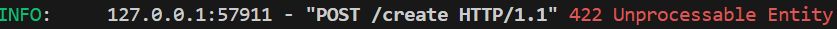

# Lilly Technical Challenge Documentation Template

_This documentation template serves as a place for you to discuss how you approached this challenge, any issues you faced & how you overcame them, or any other points that you feel would be relevant for the interviewers to know. The text in italics is here to guide you - feel free to remove it once you fill out each section!_

**_Not every section in this document is required. This is just a template to help get you started. Feel free to add or remove sections as you feel necessary._**

## Approach

_How did you approach this challenge? Did you work through the objectives in any particular order? If so, why? Did you utilize any external resources, such as tutorials, guides, or other materials?_

I began by focusing on the first objective,fetching and displaying data, since it forms the foundation for other functionalities like insert, update and delete, which depend on successful data retrieval and rendering. For presenting the fetched data, I considered two options: a card-based layout, resembling an e-commerce page, or a table. Given that only two data types (name and price) were being fetched and the task centered on CRUD operations rather than e-commerce features like integrating payment services, I opted for a table as it provided a cleaner, more practical format.

Next, I worked on adding the insertion and delete functionalities to demonstrate sending data to the backend while ensuring a user-friendly input interface. Initially, I attempted to implement a search feature but encountered some logical error (details provided in the problems section). To maintain progress, I set the search functionality aside temporarily and focused on implementing the update feature. Once the update functionality was complete, I revisited and successfully implemented the search functionality.

At this stage, I noticed that adding multiple new rows caused a default scrollbar to appear, which clashed with the overall design. To address this, I customized the scrollbar to align with the page's theme, ensuring a cohesive and polished appearance.

I also implemented the get average-price endpoint, which calculates the average price of all valid medicines, excluding null or blank entries. This ensures the calculation is accurate and meaningful despite any incomplete data.

At each stage, I implemented a functionality, thoroughly tested it, resolved any issues, and then moved on to the next objective. I prioritized adding the core functionalities first to ensure the application was fully functional before focusing on styling and enhancing the visual design.

I used Google and Stack Overflow to help resolve some of the issues I faced during the challenge. Additionally, I referred to the MDN documentation, particularly for CSS, to ensure the syntax was correct, as I’ve been primarily using Tailwind CSS for the past year.

## Objectives - Innovative Solutions

_For the challenge objectives, did you do anything in a particular way that you want to discuss? Is there anything you're particularly proud of that you want to highlight? Did you attempt some objectives multiple times, or go back and re-write particular sections of code? If so, why? Use this space to document any key points you'd like to tell us about._

Key features:

Implemented a search bar to allow users to quickly find medicines by name, improving usability when the table has many entries. Displays a message if no matching data is found.

Customized the search bar to seamlessly integrate with the overall theme of the site, ensuring a consistent design.

Implemented the key CRUD operations (Create, Read, Update, Delete).

Ensured only valid, non-null data is displayed in the table, improving data integrity and user experience.

## Problems Faced

_Use this space to document and discuss any issues you faced while undertaking this challenge and how you solved them. We recommend doing this proactively as you experience and resolve the issues - make sure you don't forget! (Screenshots are helpful, though not required)_.

One issue I encountered was a 422 error when sending a POST request to create data. After researching the error on Google and Stack Overflow, I discovered that a 422 error typically indicates an issue with the data format. Upon reviewing the backend endpoint in main.py, I realized it was expecting form data, while I was sending the data in JSON format. To resolve this, I adjusted the request to send the data as form data, aligning it with the backend's requirements.

Another challenge I faced was determining which row's delete button was pressed, as each row had a delete button. Identifying the correct row to delete was crucial. Using my prior experience with this problem, I addressed this issue with this keyword within the deleteMedicine function, which gave me access to the specific button being pressed. This allowed me to target and delete the correct row. I was also then able to apply this concept to the update button.

Additionally, I encountered a logical error in the search function. I wasn't accounting for both uppercase and lowercase letters, so when I entered a letter like "e", it only searched for medicine names containing a lowercase "e". This limited the search results and led to incomplete matches. To fix this, I ensured the search function was case-insensitive by converting both the search input and the medicine names to the same case (uppercase) before comparing them.

## Evaluation

\_How did you feel about the challenge overall? Did some parts go better than others? Did you run out of time? If you were to do this again, and were given more time, what would you do differently?

I feel that I was able to complete the objectives to a satisfactory standard within the time given, but there are definitely areas where I could improve.

Here are a couple of improvements i would make:

Implement Pagination: Replace the scrollable table with a paginated design to improve navigation and usability when dealing with large datasets, reducing time spent scrolling.

Responsive Design: Make the page fully responsive to ensure it works seamlessly on all devices, including mobile and tablets.

Environment Variables: Store critical details, such as the backend URI, in environment variables to enhance security and configurability.

Enhance Update Functionality: Improve the update experience by making it more intuitive - e.g., allow users to click "Update" to enable editing and then confirm changes with another click, rather than relying solely on pressing Enter.

Add Filters: Introduce filters to allow users to view medicines within specific price ranges, catering to diverse user needs.

Enable Sorting: Add sorting functionality to the table, allowing users to organize medicines alphabetically by name or by price in ascending or descending order for better accessibility.
